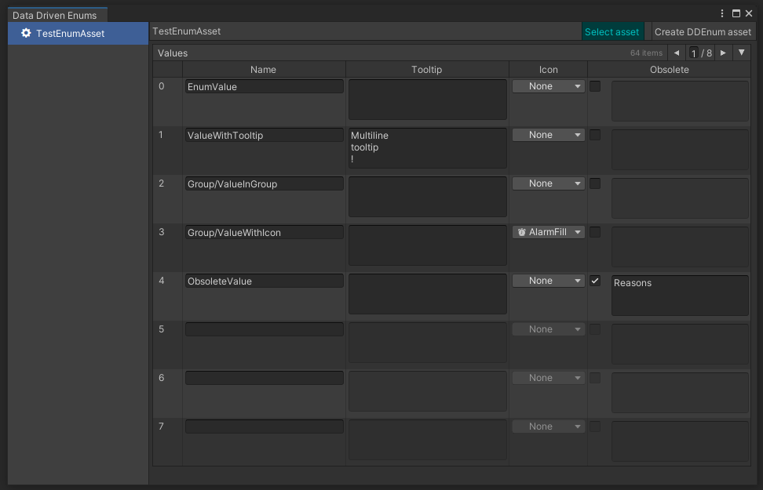

# Data Driven Enum for Odin

This project adds system for creating enums that can be modified by editing scriptable object


## Instalation

Put `DDEnum` folder into Unity project

## Usage

You need to create class that inherits frim `DDEnumAssetBase` and 2 structs that inherit from `IDDEnumMask` and `IDDEnumValue`.

Then you need to create new scriptable object asset, where values will be defined, by opening `Tools/Data Driven Enums` and then clicking `Create DDEnum asset` button. This asset will be automatically added to Preloaded Assets in `PlayerSettings`.



Each value with defined name can have:
- tooltip
- icon
- info about obsoletion

Defined values will be visible in dropdowns when using `IDDEnumMask` and `IDDEnumValue`

 

## `IDDEnumMask` extension methods

- Contains - checks if `IDDEnumMask` contains `IDDEnumValue`
- IsSuperset - checks if one `IDDEnumMask` is a superset of another `IDDEnumMask`
- IsProperSuperset - checks if one `IDDEnumMask` is a proper superset of another `IDDEnumMask`
- IsSubset - checks if one `IDDEnumMask` is a subset of another `IDDEnumMask`
- IsProperSubset - checks if one `IDDEnumMask` is a proper subset of another `IDDEnumMask`
- Overlaps - checks if there is overlap of `IDDEnumMask` and another `IDDEnumMask`
- Intersection - returns new `IDDEnumMask` that is intersection of `IDDEnumMask` and another `IDDEnumMask`
- Union - returns new `IDDEnumMask` that is union of `IDDEnumMask` and another `IDDEnumMask`
- SymmetricalExceptWith - returns new `IDDEnumMask` with values that are in `IDDEnumMask` or another `IDDEnumMask`, but not in both
- ExceptWith - returns new `IDDEnumMask` with values that are in `IDDEnumMask`, but not in another `IDDEnumMask`
- Add - returns new `IDDEnumMask` with values that are in `IDDEnumMask` with `IDDEnumValue` added
- Remove - returns new `IDDEnumMask` with values that are in `IDDEnumMask` with `IDDEnumValue` removed
- AnySet - checks if any value is set
- GetValuesEnumerator - returns enumerator of `IDDEnumMask` that enumerates on `IDDEnumValue`

## `IDDEnumValue` extension methods

- Incremented - returns new `IDDEnumValue` with value incremented to next defined value
- Decremented - returns new `IDDEnumValue` with value decremented to previous defined value
- Incremented - returns new `IDDEnumValue` with value incremented to next defined value in `IDDEnumMask`
- Decremented - returns new `IDDEnumValue` with value decremented to previous defined value in `IDDEnumMask`

## Example

``` cs

public class TestEnumAsset : DDEnumAssetBase<TestEnumAsset> { }

[Serializable]
public struct TestEnumMask : IDDEnumMask<TestEnumAsset, TestEnumValue, TestEnumMask>, IEquatable<TestEnumMask>
{
	[SerializeField] private long m_value;
	public long Value
	{
		get => m_value;
		set => m_value = value;
	}

	public bool Equals(IDDEnumMask<TestEnumAsset, TestEnumValue, TestEnumMask> other) => other != null && other.Value == m_value;

	public bool Equals(TestEnumMask other)
	{
		return m_value == other.m_value;
	}

	public IEnumerator<TestEnumValue> GetEnumerator() => this.GetValuesEnumerator();

	IEnumerator IEnumerable.GetEnumerator() => GetEnumerator();

	public override bool Equals(object obj) => obj is TestEnumMask other && Equals(other);

	public override int GetHashCode() => m_value.GetHashCode();
}

[Serializable]
public struct TestEnumValue : IDDEnumValue<TestEnumAsset, TestEnumValue>, IEquatable<TestEnumValue>
{
	[SerializeField] private int m_value;

	public int Value
	{
		get => m_value;
		set => m_value = value;
	}

	public long BitValue => IDDEnumValue<TestEnumAsset, TestEnumValue>.GetBitValue(this);

	public bool Equals(TestEnumValue other) => m_value == other.m_value;

	public bool Equals(IDDEnumValue<TestEnumAsset, TestEnumValue> other) => other != null && m_value == other.Value;

	public override bool Equals(object obj) => obj is TestEnumValue other && Equals(other);

	public override int GetHashCode() => m_value;
}


```
